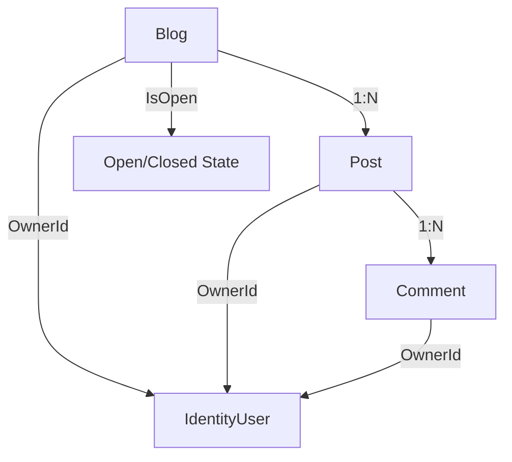

# 🧪 Unit Testing Documentation for DTE-2802-1-25H-Oblig1-MVC

## Overview

This document details the unit testing strategy and implementation for the educational blog solution. The project uses ASP.NET Core, Entity Framework Core, and the Repository Design Pattern to deliver a robust, testable blog system.

---

## 🏗️ Solution Architecture

**Core Components:**
- Models: `Blog`, `Post`, `Comment`, `ErrorViewModel`
- Controllers: `BlogController`, `PostController`, `CommentController`, `HomeController`
- Repositories: `IBlogRepository`, `BlogRepository`, `IPostRepository`, `PostRepository`, `ICommentRepository`, `CommentRepository`
- Data Context: `BlogContext` (inherits from `IdentityDbContext`)

**Entity Relationships:**


---

## 🧰 Testing Strategy

**Frameworks Used:**
- xUnit: Unit testing framework
- Moq: Mocking dependencies
- Entity Framework In-Memory: Integration testing
- coverlet.collector: Code coverage analysis

**Coverage Goals:**
- Target: ~100% coverage on controllers (per requirements)
- Scope: Controllers, repositories, error handling, authentication/authorization

---

## 📂 Test Files & Coverage

### BlogControllerTests.cs
Tests blog CR operations (Create/Read), error handling, and listing.
- `Index_ReturnsViewWithBlogs()`
- `Details_BlogExists_ReturnsViewWithBlog()`
- `Details_BlogNotFound_ReturnsNotFound()`
- `Create_Get_ReturnsView()`

**Requirements Covered:** Blog listing, creation, reading, error handling.

### PostControllerTests.cs
Tests post CRUD operations, ownership, and error handling.
- `Index_ReturnsViewWithPosts()`
- `Details_PostExists_ReturnsViewWithPost()`
- `Details_PostNotFound_ReturnsNotFound()`

**TODO:** Add tests for create/edit/delete, ownership, blog open/close status.

**Requirements Covered:** Post listing, CRUD, ownership, authentication.

### CommentControllerTests.cs
Tests comment CRUD operations, ownership, and error handling.
- `Index_ReturnsViewWithComments()`
- `Details_CommentExists_ReturnsViewWithComment()`
- `Details_CommentNotFound_ReturnsNotFound()`
- `Create_Get_ReturnsView()`

**TODO:** Add tests for create/edit/delete, ownership, blog open/close, model validation.

**Requirements Covered:** Comment display, CRUD, ownership, blog open/close.

### HomeControllerTests.cs
Tests navigation, privacy, and error handling.
- `Index_RedirectsToBlogIndex()`
- `Privacy_ReturnsView()`
- `Error_ReturnsViewWithErrorModel()`
- `Error_WithActivity_UsesActivityId()`

**Requirements Covered:** Navigation, error handling, request tracking.

### RepositoryTests.cs
Tests repository pattern and data access.
- `BlogRepository_GetAllAsync_ReturnsAllBlogs()`
- `BlogRepository_GetByIdAsync_ExistingBlog_ReturnsBlogWithPosts()`
- `BlogRepository_GetByIdAsync_NonExistingBlog_ReturnsNull()`
- `BlogRepository_AddAsync_PersistsBlogToDatabase()`
- `BlogRepository_UpdateAsync_ModifiesExistingBlog()`
- `BlogRepository_DeleteAsync_ExistingBlog_RemovesBlogFromDatabase()`
- `BlogRepository_DeleteAsync_NonExistingBlog_DoesNotThrowException()`

**TODO:** Add comprehensive tests for PostRepository, CommentRepository, EF relationships, cascade delete.

**Requirements Covered:** Repository pattern, EF integration, persistence, cascade delete.

---

## 🏆 Best Practices

- **Test Isolation:** Unique in-memory DB per test, mocked dependencies.
- **AAA Pattern:** Arrange, Act, Assert for clarity.
- **Documentation:** XML comments, requirements mapping, TODOs for coverage.
- **Mocking:** Moq isolates controller logic from data layer.
- **Error Testing:** Success/failure paths, HTTP status codes, graceful error handling.

---

## 📋 Requirements Traceability

| # | Requirement                                      | Status           | Implementation/Tests |
|---|--------------------------------------------------|------------------|---------------------|
| 1 | Authentication & Ownership                       | ⚠️ Partial       | [Authorize], OwnerId, needs user context mocking |
| 2 | Blog & Post Overview                             | ✅ Complete      | BlogControllerTests.Index, PostControllerTests.Index |
| 3 | Comment Display                                  | ✅ Basic         | CommentControllerTests.Index, .Details |
| 4 | CRUD Operations                                  | ⚠️ Partial       | Blog: CR tested; Post/Comment: basic, needs full CRUD |
| 5 | Ownership & Authorization                        | ⚠️ Structure     | OwnerId, authorization checks, needs failure tests |
| 6 | Blog Open/Close Feature                          | ⚠️ Structure     | IsOpen property, needs validation tests |
| 7 | Parameter Passing (GET/POST)                     | ✅ Implicit      | Standard MVC, covered by action tests |

---

## 🚀 Recommendations for 100% Coverage

1. **Controller Testing:**
	- Implement all TODOs in PostControllerTests and CommentControllerTests
	- Add authentication/authorization tests
2. **Integration Testing:**
	- Test EF relationships and cascade delete
	- Validate blog open/close restrictions
3. **Repository Testing:**
	- Complete PostRepository and CommentRepository tests
	- Add integration tests for repository-context
4. **Authentication Testing:**
	- Mock User.Identity for ownership
	- Test [Authorize] and access control
	- Validate ownership logic

---

## 🎤 Usage for Presentation

This documentation supports your presentation by:
- Explaining technical architecture and repository pattern
- Mapping tests to requirements for traceability
- Demonstrating code quality and best practices
- Providing executable proof of requirements compliance

---

## 🏃 Test Execution

To run all tests:
```sh
dotnet test
```

To run with coverage:
```sh
dotnet test --collect:"XPlat Code Coverage"
```

---

The current test suite provides a strong foundation for demonstrating reliability and correctness during your project presentation.