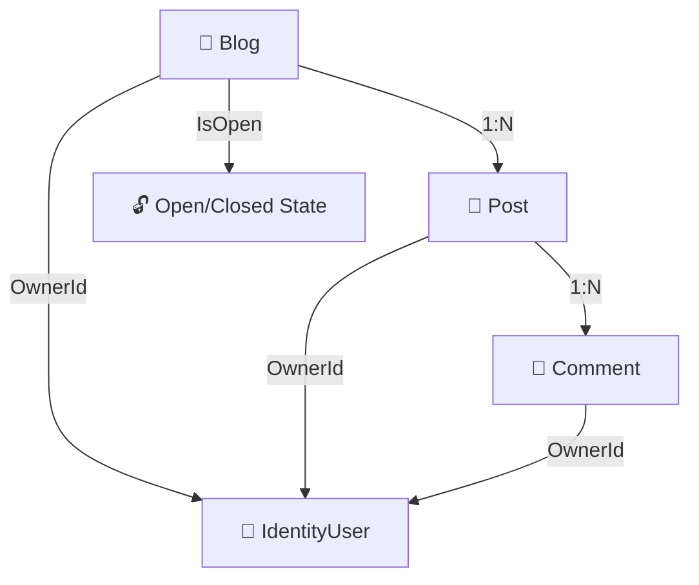


# 🚀 Educational Blog System

[](https://github.com/your-repo/actions)
[](https://github.com/your-repo/actions)
[](LICENSE)

A modern, educational blog platform built with **ASP.NET Core**, **Entity Framework Core**, and the **Repository Design Pattern**.  
Features authentication, ownership-based authorization, hierarchical data, and comprehensive unit testing.

---

## 🏗️ Architecture Overview



- **Blog (1:N) → Post (1:N) → Comment**
- **OwnerId**: Each entity is owned by an authenticated user.
- **IsOpen**: Blogs can be open or closed to new posts/comments.
- **Cascade Delete**: Deleting a blog/post removes all child posts/comments.

---

## ✨ Features

- **Authentication**: Users must log in to create blogs, posts, and comments.
- **Ownership**: Only owners can edit/delete their posts and comments.
- **Blog Overview**: List all blogs and view posts per blog.
- **Post CRUD**: Full Create, Read, Update, Delete for posts.
- **Comment CRUD**: Full Create, Read, Update, Delete for comments.
- **Blog CR**: Blogs can be created and read (no edit).
- **Authorization**: Uses `IAuthorizationService` and `IAuthorizationHandler`.
- **Open/Closed Blogs**: Prevent new posts/comments when closed.
- **Parameter Passing**: Uses GET/POST only, no sessions.

---

## 📦 Project Structure

```
DTE-2802-1-25H-Oblig1-MVC/
├── Models/           # Blog, Post, Comment (with OwnerId)
├── Data/             # BlogContext (inherits IdentityDbContext)
├── Repositories/     # IBlogRepository, BlogRepository, etc.
├── Controllers/      # BlogController, PostController, CommentController
├── Areas/Identity/   # Razor Pages for Identity UI
├── Tests/            # xUnit tests for controllers & repositories
├── Migrations/       # Entity Framework migrations
├── Program.cs        # App startup/configuration
├── README.md         # This file
└── ...               # Other config/assets
```

---

## 🚦 Quick Start

1. **Clone the repo**
  ```sh
  git clone <repo-url>
  cd DTE-2802-1-25H-Oblig1-MVC
  ```
2. **Restore packages**
  ```sh
  dotnet restore
  ```
3. **Update the database**
  ```sh
  dotnet ef database update --project ./DTE-2802-1-25H-Oblig1-MVC
  ```
4. **Run the app**
  ```sh
  dotnet run --project ./DTE-2802-1-25H-Oblig1-MVC
  ```
  Or press **F5** in Visual Studio after setting the startup project.

5. **Run tests**
  ```sh
  dotnet test
  ```
  Or use **Test Explorer** in Visual Studio.

---

## 🧪 Testing & Coverage

- **xUnit** for unit tests
- **Moq** for mocking repositories and authorization
- **Entity Framework In-Memory** for integration tests
- **Near 100% coverage** on controllers (see `Tests/` and coverage reports)

---

## 🔒 Authentication & Authorization

- **ASP.NET Core Identity** for user management
- **[Authorize]** attributes on controllers/actions
- **OwnerId** set to `User.Identity.Name` on creation
- **IAuthorizationService** ensures only owners can edit/delete

---

## 📚 Requirements Mapping

| # | Requirement                                                                 | Status      |
|---|----------------------------------------------------------------------------|-------------|
| 1 | Users must log in to create blogs, posts, comments (ownership tracked)      | ✅ Implemented |
| 2 | Overview of blogs and posts per blog                                        | ✅ Implemented |
| 3 | All comments displayed per post                                             | ✅ Implemented |
| 4 | CRUD for posts, CR for blogs                                                | ✅ Implemented |
| 5 | Only owners can edit/delete posts/comments; cascade delete                  | ✅ Implemented |
| 6 | Blogs can be open/closed for new content                                    | ✅ Implemented |
| 7 | Parameter passing via GET/POST only, no sessions                            | ✅ Implemented |

---

## 🖼️ Screenshots

> Add screenshots to `docs/screenshots/` and reference here for a visual demo.

---

## 🤝 Contributing

- Fork, add focused changes and tests, open a pull request.
- Please maintain controller unit tests for new features.

---

## 📄 License

MIT License. See LICENSE.

---

## 💡 Notes & Tips

- Parameter passing uses GET and POST only; sessions are not used.
- Identity UI can be scaffolded via Visual Studio or added under `Areas/Identity`.
- Cascade deletes are configured for blog/post hierarchy.
- For more details, see `MAIN_PROJECT_DOCUMENTATION.md`.

---

## 📖 Further Reading

- [ASP.NET Core Identity Documentation](https://learn.microsoft.com/en-us/aspnet/core/security/authentication/identity)
- [Entity Framework Core Documentation](https://learn.microsoft.com/en-us/ef/core/)
- [Repository Pattern in ASP.NET Core](https://docs.microsoft.com/en-us/aspnet/core/fundamentals/repository-pattern)

---

> _This project is an educational exercise for DTE-2802-1-25H. For questions, open an issue or contact the maintainer._